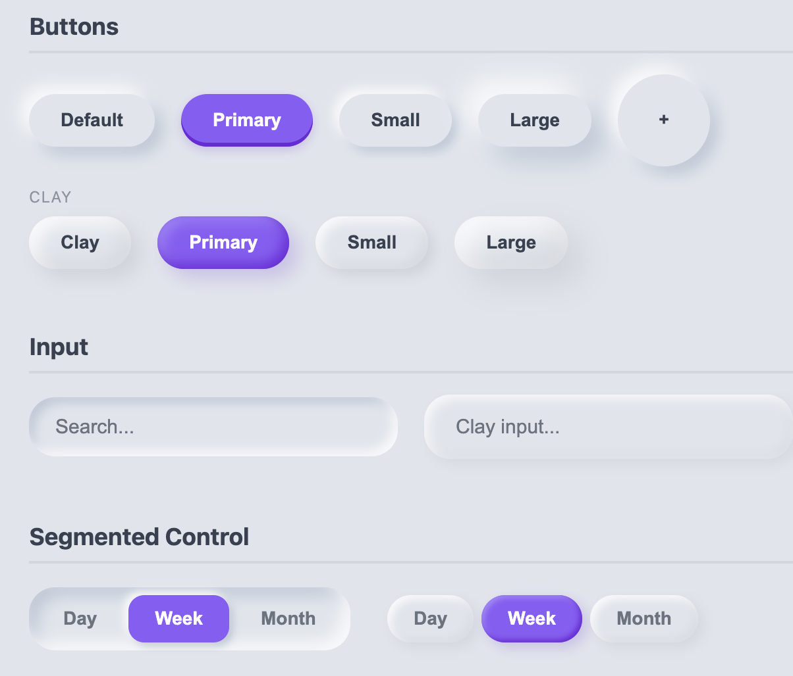
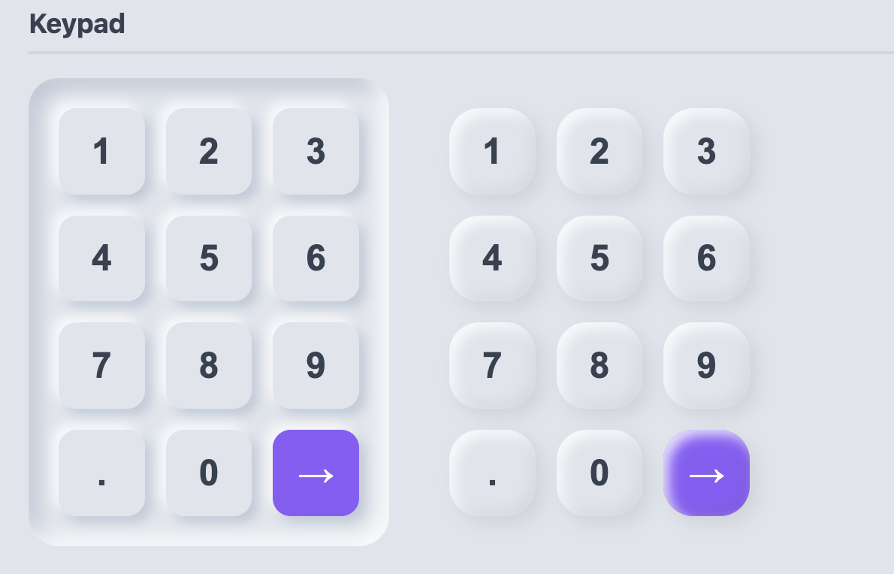
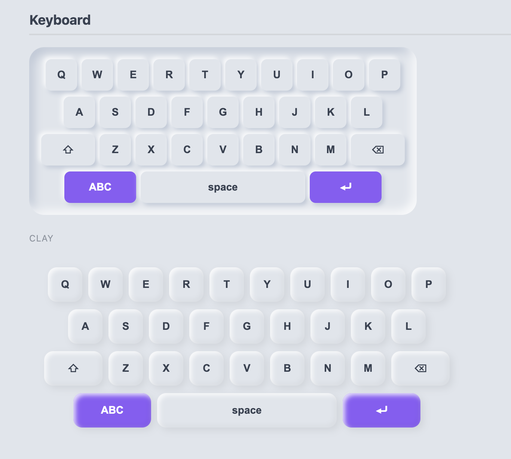
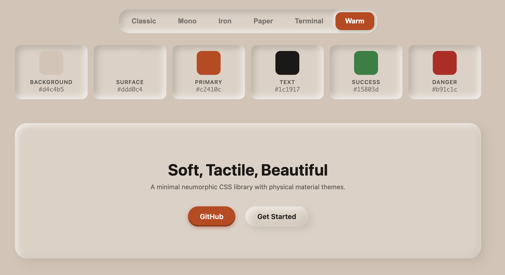
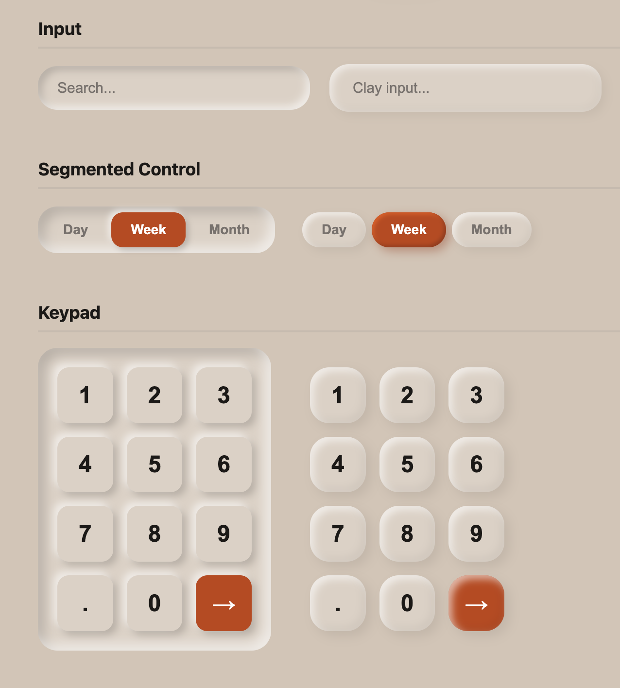
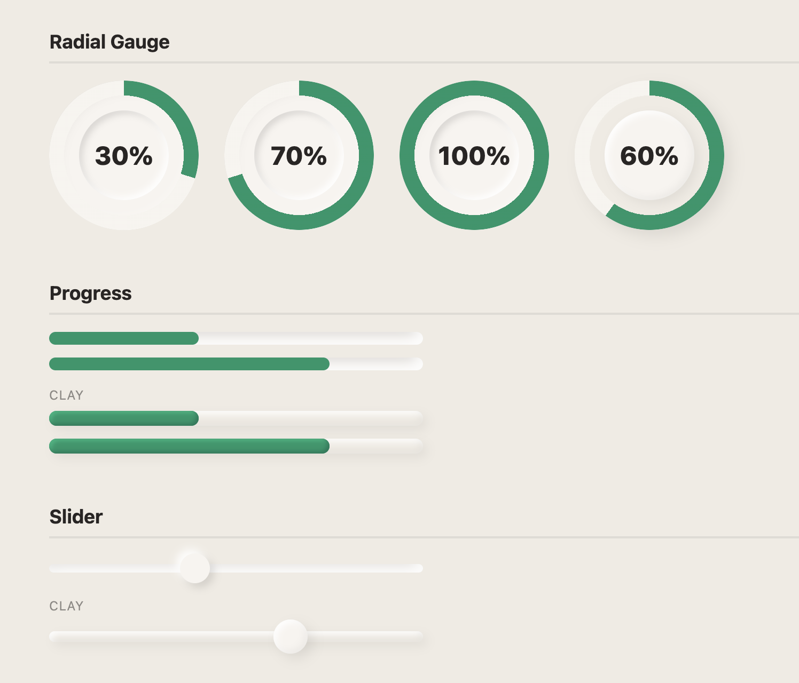
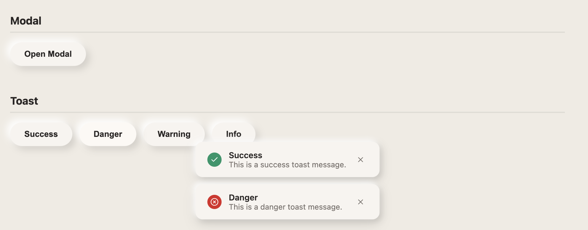

# Tactile CSS

A minimal neumorphic CSS library with outer, inner, and clay shadow styles. Physical material themes included.

<p align="center">
  
</p>

<p align="center">
  
</p>

<p align="center">
  
</p>

<p align="center">
  
</p>

<p align="center">
  
</p>

<p align="center">
  
</p>

<p align="center">
  
</p>

## Features

- **Three Shadow Styles**: Outer (raised), Inner (sculpted), and Clay (fluffy claymorphism)
- **Six Themes**: Classic, Mono, Iron, Paper, Terminal, Warm
- **Zero Dependencies**: Pure CSS, no JavaScript required
- **Tailwind Plugin**: Optional Tailwind CSS integration
- **Tiny**: ~22KB minified

## Installation

### npm

```bash
npm install tactile-css
```

### CDN (jsDelivr)

```html
<link rel="stylesheet" href="https://cdn.jsdelivr.net/npm/tactile-css/dist/tactile.min.css">
```

### CDN (unpkg)

```html
<link rel="stylesheet" href="https://unpkg.com/tactile-css/dist/tactile.min.css">
```

### Download

- [tactile.css](https://github.com/liliang-cn/TactileCSS/blob/main/dist/tactile.css)
- [tactile.min.css](https://github.com/liliang-cn/TactileCSS/blob/main/dist/tactile.min.css)

## Quick Start

```html
<!DOCTYPE html>
<html lang="en">
<head>
  <link rel="stylesheet" href="https://cdn.jsdelivr.net/npm/tactile-css/dist/tactile.min.css">
</head>
<body class="tactile">
  <div class="tactile-outer p-6 rounded-xl">
    Hello, Tactile!
  </div>
</body>
</html>
```

## React

Install the CSS package and React peer dependency:

```bash
npm install tactile-css react
```

Import the stylesheet once, then use the React wrappers from `tactile-css/react`:

```jsx
import 'tactile-css/css';
import {
  TactileButton,
  TactileCard,
  TactileGauge,
  TactileInput,
  TactileSegment,
  TactileSegmented,
  TactileTheme,
} from 'tactile-css/react';

export function Demo() {
  return (
    <TactileTheme theme="paper" style={{ padding: 24 }}>
      <TactileCard variant="clay" style={{ padding: 24, borderRadius: 24 }}>
        <TactileSegmented>
          <TactileSegment>Day</TactileSegment>
          <TactileSegment active>Week</TactileSegment>
          <TactileSegment>Month</TactileSegment>
        </TactileSegmented>

        <TactileInput placeholder="Search..." style={{ marginTop: 16 }} />

        <div style={{ display: 'flex', gap: 16, marginTop: 16, alignItems: 'center' }}>
          <TactileButton variant="primary">Save</TactileButton>
          <TactileGauge value={72} label="Focus" />
        </div>
      </TactileCard>
    </TactileTheme>
  );
}
```

Initial React exports:

- `TactileTheme`
- `TactileSurface`
- `TactileButton`
- `TactileInput`
- `TactileField`
- `TactileFieldLabel`
- `TactileFieldHint`
- `TactileSelect`
- `TactileTextarea`
- `TactileCard`
- `TactileFab`
- `TactileSegmented`
- `TactileSegment`
- `TactileTabs`
- `TactileTabList`
- `TactileTab`
- `TactileTabPanel`
- `TactileSlider`
- `TactileProgress`
- `TactileGauge`
- `TactileKeypad`
- `TactileKey`
- `TactileKeyboard`
- `TactileKeyboardRow`
- `TactileKeyboardKey`
- `TactileBadge`
- `TactileAvatar`
- `TactileDivider`
- `TactileCheckbox`
- `TactileSwitch`
- `TactileTone`
- `TactileModalOverlay`
- `TactileModalHeader`
- `TactileModalTitle`
- `TactileModalClose`
- `TactileModalBody`
- `TactileModalFooter`
- `TactileModal`
- `TactileToast`
- `TactileToastContainer`
- `TactileToastIcon`
- `TactileToastContent`
- `TactileToastTitle`
- `TactileToastMessage`
- `TactileToastClose`
- `TactileAccordion`
- `TactileAccordionItem`
- `TactileAccordionTrigger`
- `TactileAccordionContent`
- `TactileIcon`
- `TactileText`

The React package now covers the core surfaces, forms, navigation, feedback, and visual effect primitives that already exist in the CSS library. Future releases can keep expanding into higher-level composed patterns on top of this base layer.

It also exposes composition primitives for field, modal, and toast layouts, so you can either use the bundled `TactileModal` / `TactileToast` helpers or assemble your own structures from the same class-backed parts.

```jsx
import {
  TactileButton,
  TactileField,
  TactileFieldHint,
  TactileFieldLabel,
  TactileInput,
  TactileModalBody,
  TactileModalClose,
  TactileModalFooter,
  TactileModalHeader,
  TactileModalOverlay,
  TactileModalTitle,
  TactileToast,
  TactileTone,
} from 'tactile-css/react';

export function ComposedDemo() {
  return (
    <>
      <TactileField>
        <TactileFieldLabel htmlFor="name">Name</TactileFieldLabel>
        <TactileInput id="name" placeholder="Ada Lovelace" />
        <TactileFieldHint>Shown on your public profile.</TactileFieldHint>
      </TactileField>

      <TactileModalOverlay open>
        <div className="tactile-modal" role="dialog" aria-modal="true">
          <TactileModalHeader>
            <TactileModalTitle>Upgrade plan</TactileModalTitle>
            <TactileModalClose aria-label="Close">×</TactileModalClose>
          </TactileModalHeader>
          <TactileModalBody>
            <TactileTone className="tactile-badge" tone="success">Live</TactileTone>
          </TactileModalBody>
          <TactileModalFooter>
            <TactileButton variant="primary">Continue</TactileButton>
          </TactileModalFooter>
        </div>
      </TactileModalOverlay>

      <TactileToast tone="success" title="Saved" message="Preferences updated." />
    </>
  );
}
```

## Vue

Install the CSS package and Vue peer dependency:

```bash
npm install tactile-css vue
```

Import the stylesheet once, then use the Vue wrappers from `tactile-css/vue`:

```vue
<script setup>
import 'tactile-css/css'
import {
  TactileButton,
  TactileCard,
  TactileGauge,
  TactileInput,
  TactileSegment,
  TactileSegmented,
  TactileTheme,
} from 'tactile-css/vue'

const focus = 72
</script>

<template>
  <TactileTheme theme="paper" style="padding: 24px;">
    <TactileCard variant="clay" style="padding: 24px; border-radius: 24px;">
      <TactileSegmented>
        <TactileSegment>Day</TactileSegment>
        <TactileSegment active>Week</TactileSegment>
        <TactileSegment>Month</TactileSegment>
      </TactileSegmented>

      <TactileInput placeholder="Search..." style="margin-top: 16px;" />

      <div style="display: flex; gap: 16px; margin-top: 16px; align-items: center;">
        <TactileButton variant="primary">Save</TactileButton>
        <TactileGauge :value="focus" label="Focus" />
      </div>
    </TactileCard>
  </TactileTheme>
</template>
```

The Vue package mirrors the React export surface, including the field, modal, toast, accordion, keyboard, slider, icon, and text primitives. Use `v-model` on `TactileInput`, `TactileTextarea`, `TactileSelect`, `TactileCheckbox`, `TactileSwitch`, and `TactileSlider` where it makes sense.

```vue
<script setup>
import {
  TactileButton,
  TactileField,
  TactileFieldHint,
  TactileFieldLabel,
  TactileInput,
  TactileModalBody,
  TactileModalClose,
  TactileModalFooter,
  TactileModalHeader,
  TactileModalOverlay,
  TactileModalTitle,
  TactileTone,
} from 'tactile-css/vue'
import { ref } from 'vue'

const name = ref('Ada Lovelace')
</script>

<template>
  <TactileField>
    <TactileFieldLabel for="name">Name</TactileFieldLabel>
    <TactileInput id="name" v-model="name" />
    <TactileFieldHint>Shown on your public profile.</TactileFieldHint>
  </TactileField>

  <TactileModalOverlay open>
    <div class="tactile-modal" role="dialog" aria-modal="true">
      <TactileModalHeader>
        <TactileModalTitle>Upgrade plan</TactileModalTitle>
        <TactileModalClose aria-label="Close">×</TactileModalClose>
      </TactileModalHeader>
      <TactileModalBody>
        <TactileTone class="tactile-badge" tone="success">Live</TactileTone>
      </TactileModalBody>
      <TactileModalFooter>
        <TactileButton variant="primary">Continue</TactileButton>
      </TactileModalFooter>
    </div>
  </TactileModalOverlay>
</template>
```

## Shadow Styles

### Outer (Raised)

Creates a raised, elevated effect.

```html
<div class="tactile-outer">Raised element</div>
<div class="tactile-outer tactile-sm">Small raised</div>
<div class="tactile-outer tactile-lg">Large raised</div>
```

### Inner (Sculpted)

Creates an inset, sculpted effect.

```html
<div class="tactile-inner">Inset element</div>
<div class="tactile-inner tactile-sm">Small inset</div>
```

### Clay (Claymorphism)

Creates a fluffy, inflated balloon-like effect with dual inner shadows and floating outer shadow.

```html
<div class="tactile-clay">Fluffy element</div>
<div class="tactile-clay tactile-lg">Large fluffy</div>
```

## Themes

Switch themes by adding `data-theme` attribute to `<html>` or any parent element.

```html
<html data-theme="iron">
```

| Theme | Description |
|-------|-------------|
| `classic` | Soft gray-blue (default) |
| `mono` | Black and white minimalist |
| `iron` | Dark cast iron, gym/fitness feel |
| `paper` | Warm paper, reading/memory cards |
| `terminal` | GitHub dark theme style |
| `warm` | Warm retro, cozy feel |

## Components

### Buttons

```html
<button class="tactile-button">Default</button>
<button class="tactile-button-primary">Primary</button>
<button class="tactile-button-clay">Clay Button</button>
<button class="tactile-button-clay-primary">Clay Primary</button>
```

### Input

```html
<input type="text" class="tactile-input" placeholder="Search...">
<input type="text" class="tactile-input-clay" placeholder="Clay input...">
```

### Field / Select / Textarea

```html
<div class="tactile-field">
  <label class="tactile-field-label">Theme</label>
  <select class="tactile-select">
    <option>Classic</option>
    <option>Paper</option>
  </select>
  <div class="tactile-field-hint">Use tactile inputs for forms.</div>
</div>

<textarea class="tactile-textarea" placeholder="Write something..."></textarea>
```

### Badge

```html
<span class="tactile-badge">Default</span>
<span class="tactile-badge tactile-badge-primary">Primary</span>
<span class="tactile-badge-clay tactile-badge-success">Success</span>
```

### Avatar

```html
<div class="tactile-avatar">AL</div>
<div class="tactile-avatar tactile-avatar-lg tactile-avatar-clay">AL</div>
```

### Checkbox & Switch

```html
<input type="checkbox" class="tactile-checkbox" checked>
<input type="checkbox" class="tactile-checkbox tactile-checkbox-clay">

<input type="checkbox" role="switch" class="tactile-switch" checked>
<input type="checkbox" role="switch" class="tactile-switch tactile-switch-clay">
```

### Divider

```html
<hr class="tactile-divider">
<div class="tactile-divider-vertical"></div>
```

### Cards

```html
<div class="tactile-card tactile-outer">Raised card</div>
<div class="tactile-card tactile-inner">Inset card</div>
<div class="tactile-card-clay">Clay card</div>
```

### FAB (Floating Action Button)

```html
<button class="tactile-fab tactile-fab-sm">+</button>
<button class="tactile-fab">+</button>
<button class="tactile-fab tactile-fab-lg">+</button>
<button class="tactile-fab-clay">+</button>
```

### Segmented Control

```html
<div class="tactile-segmented tactile-inner">
  <button class="tactile-segment">Day</button>
  <button class="tactile-segment tactile-active">Week</button>
  <button class="tactile-segment">Month</button>
</div>

<div class="tactile-segmented-clay">
  <button class="tactile-segment tactile-active">Day</button>
  <button class="tactile-segment">Week</button>
  <button class="tactile-segment">Month</button>
</div>
```

### Tabs

```html
<div class="tactile-tabs">
  <div class="tactile-tab-list tactile-inner">
    <button class="tactile-tab tactile-active" aria-selected="true">Overview</button>
    <button class="tactile-tab">Usage</button>
    <button class="tactile-tab">Tokens</button>
  </div>
  <div class="tactile-tab-panel">
    Tactile tabs reuse the same soft, pressed state.
  </div>
</div>
```

### Keypad

```html
<div class="tactile-keypad tactile-inner">
  <button class="tactile-key">1</button>
  <button class="tactile-key">2</button>
  <button class="tactile-key">3</button>
  <!-- ... -->
  <button class="tactile-key tactile-key-action">→</button>
</div>
```

### Keyboard

```html
<div class="tactile-keyboard tactile-inner">
  <div class="tactile-keyboard-row">
    <button class="tactile-keyboard-key">Q</button>
    <button class="tactile-keyboard-key">W</button>
    <!-- ... -->
  </div>
  <div class="tactile-keyboard-row">
    <button class="tactile-keyboard-key tactile-keyboard-key-wide">⇧</button>
    <!-- ... -->
  </div>
</div>
```

### Progress & Slider

```html
<div class="tactile-track tactile-inner">
  <div class="tactile-track-fill" style="width: 60%;"></div>
</div>

<div class="tactile-slider">
  <div class="tactile-slider-track tactile-inner"></div>
  <div class="tactile-slider-thumb tactile-outer" style="left: 40%;"></div>
</div>
```

### Icon & Text Effects

```html
<span class="tactile-icon-raised">★</span>
<span class="tactile-icon-sculpted">★</span>
<p class="tactile-text-sculpted">Soft engraved label</p>
```

### Radial Gauge

```html
<div class="tactile-gauge tactile-inner" style="--progress: 70%;">
  <div class="tactile-gauge-center">
    <span class="tactile-gauge-value">70%</span>
  </div>
</div>
```

### Modal

```html
<div class="tactile-modal-overlay tactile-open">
  <div class="tactile-modal">
    <div class="tactile-modal-header">
      <h3 class="tactile-modal-title">Delete item?</h3>
      <button class="tactile-modal-close">×</button>
    </div>
    <div class="tactile-modal-body">This action cannot be undone.</div>
    <div class="tactile-modal-footer">
      <button class="tactile-button">Cancel</button>
      <button class="tactile-button-primary">Delete</button>
    </div>
  </div>
</div>
```

### Toast

```html
<div class="tactile-toast-container">
  <div class="tactile-toast tactile-toast-success tactile-toast-show">
    <div class="tactile-toast-icon">✓</div>
    <div class="tactile-toast-content">
      <div class="tactile-toast-title">Saved</div>
      <div class="tactile-toast-message">Changes have been written.</div>
    </div>
  </div>
</div>
```

### Accordion

```html
<div class="tactile-accordion">
  <details class="tactile-accordion-item" open>
    <summary class="tactile-accordion-trigger">What is Tactile CSS?</summary>
    <div class="tactile-accordion-content">
      A neumorphic component library with theme tokens and React wrappers.
    </div>
  </details>
</div>
```

### Colors

```html
<div class="tactile-outer tactile-primary">Primary</div>
<div class="tactile-outer tactile-success">Success</div>
<div class="tactile-outer tactile-danger">Danger</div>
<div class="tactile-outer tactile-warning">Warning</div>
<div class="tactile-outer tactile-info">Info</div>
```

## Tailwind CSS Integration

### Install

```bash
npm install tactile-css tailwindcss
```

### Configure

```js
// tailwind.config.js
module.exports = {
  plugins: [
    require('tactile-css/tailwind'),
  ],
}
```

### Usage

```html
<!-- Combine Tactile shadows with Tailwind utilities -->
<div class="tactile-outer p-6 rounded-xl">
  Card with Tailwind spacing
</div>

<button class="tactile-button px-6 py-3 rounded-full font-semibold">
  Button with Tailwind styles
</button>

<!-- Use extended colors -->
<div class="bg-tactile-primary text-white p-4">
  Primary background
</div>
```

## CSS Variables

All theme values are available as CSS variables:

```css
:root {
  --tactile-bg: #e0e5ec;
  --tactile-surface: #e0e5ec;
  --tactile-primary: #8B5CF6;
  --tactile-primary-light: #A78BFA;
  --tactile-primary-dark: #6D28D9;
  --tactile-text: #374151;
  --tactile-text-muted: #6b7280;
  --tactile-text-inverse: #ffffff;
  --tactile-success: #10B981;
  --tactile-danger: #EF4444;
  --tactile-warning: #F59E0B;
  --tactile-info: #3B82F6;
  --tactile-offset: 6px;
  --tactile-blur: 12px;
  --tactile-radius-sm: 6px;
  --tactile-radius-md: 12px;
  --tactile-radius-lg: 20px;
}
```

## Customization

Override CSS variables to customize:

```css
:root {
  --tactile-primary: #ff6b6b;
  --tactile-bg: #f8f9fa;
}
```

Or create a custom theme:

```css
:root[data-theme="custom"] {
  --tactile-bg: #your-color;
  --tactile-surface: #your-color;
  --tactile-primary: #your-color;
  /* ... */
}
```

## Browser Support

Works in all modern browsers that support CSS variables and box-shadow.

## License

MIT
